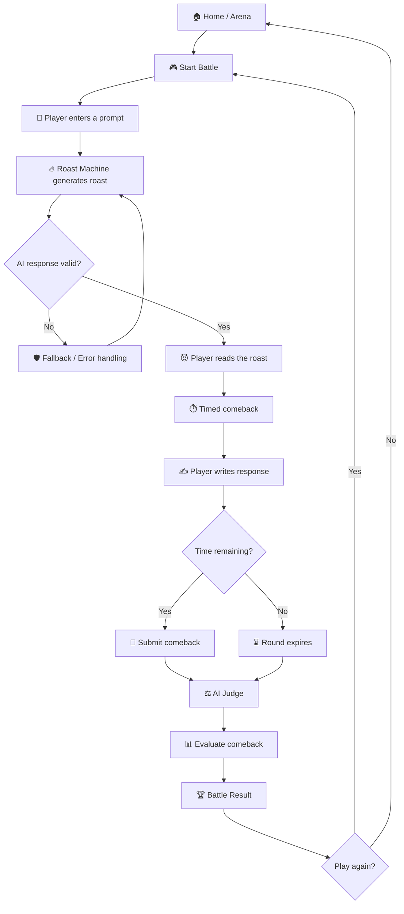
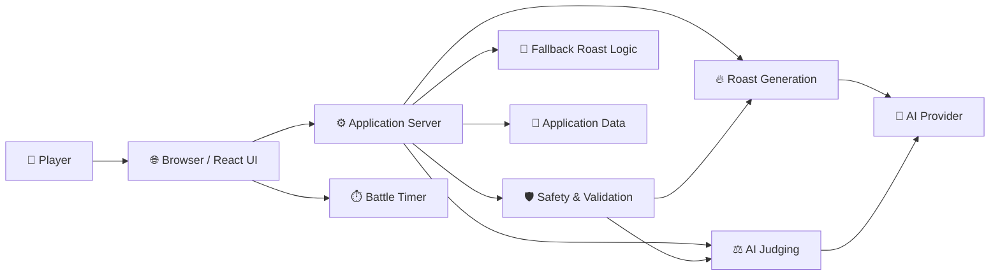
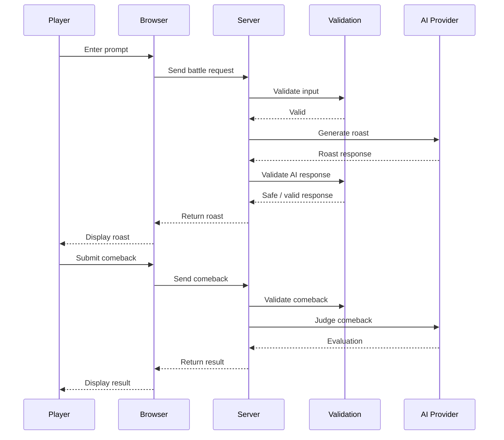
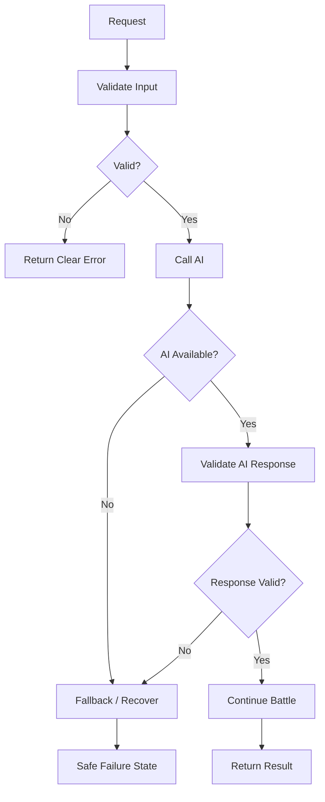

# 🔥 AI Roast Battle

> **Say something. Get roasted. Fire back.**

**AI Roast Battle** is a browser-based comedy game where you challenge an AI in a timed roast battle.

Give the Roast Machine something to work with. The AI fires the first roast. You get a limited amount of time to write your comeback. An AI judge then evaluates the exchange and presents the result.

The goal is simple:

**Make the AI regret starting the fight.**

---

## 🎮 What Is AI Roast Battle?

AI Roast Battle turns an ordinary AI interaction into a competitive comedy game.

Instead of asking an AI to simply answer a question, the player enters a battle:

1. Give the AI a topic, statement, or personal prompt.
2. The Roast Machine generates a roast.
3. The player gets a limited time to respond.
4. The comeback is submitted.
5. The AI judge evaluates the response.
6. The player sees the battle result.
7. Play again or try another mode.

The experience is designed around **short rounds, quick reactions, humor, and replayability**.

---

## ✨ Core Features

### 🥊 Roast Battle

The main game loop:

**Prompt → AI Roast → Timed Comeback → AI Judgement → Result**

### ⏱️ Timed Comeback

The player has a limited amount of time to respond to the AI roast.

The timer creates pressure and prevents players from spending forever trying to write the perfect joke.

### 🤖 AI Roast Generation

The application can use an AI model to generate the opponent's roast.

AI provider configuration is kept on the server rather than exposed directly to the browser.

### ⚖️ AI Judging

The comeback can be evaluated across dimensions such as:

- **Creativity**
- **Comedy**
- **Damage**

The judge also produces a final battle verdict.

### 🎭 Battle Modes

The project is structured around multiple game modes:

| Mode | Description |
|---|---|
| **Standard Battle** | The normal AI roast battle |
| **30 Seconds Chaos** | A faster, time-pressure format |
| **Developer Mode** | A technical/developer-themed battle experience |
| **Daily Challenge** | A challenge format designed around a daily prompt |

> Only advertise modes that are enabled and working in the deployed version.

### 🌶️ Heat Levels

Players can choose the tone of the battle:

- **Mild**
- **Spicy**
- **Savage**

The selected level influences the intended roast intensity.

### 🛡️ Safety Handling

The project includes server-side handling intended to reduce unsafe or inappropriate AI output and to handle problematic input/output.

AI output should always be treated as untrusted external data.

### 🧯 Failure & Resilience Handling

The project is designed with failure cases in mind, including:

- AI timeouts
- API failures
- Rate limits
- Empty AI responses
- Malformed AI responses
- Invalid user input
- Expired rounds
- Duplicate submissions
- Prompt injection attempts

---

# 🧭 Game Flow



---

# 🏗️ High-Level Architecture



---

# 🔄 Request Flow

A typical battle request follows this pattern:

```text
Player
  │
  ▼
Browser UI
  │
  ▼
Application Server
  │
  ├── Validate input
  │
  ├── Apply safety checks
  │
  ├── Request AI roast
  │        │
  │        ▼
  │      AI Provider
  │        │
  │        ▼
  │      AI response
  │
  ├── Validate AI response
  │
  ▼
Display Roast
  │
  ▼
Start / Continue Timer
  │
  ▼
Player submits comeback
  │
  ▼
Application Server
  │
  ▼
AI Judge
  │
  ├── Creativity
  ├── Comedy
  └── Damage
  │
  ▼
Battle Result
```

---

# 🧩 Project Architecture

The repository is organized around a frontend, server-side game logic, AI integration, safety handling, and supporting utilities.

A simplified view:

```text
AI Roast Battle
│
├── src/
│   ├── App.tsx
│   ├── main.tsx
│   ├── types.ts
│   │
│   ├── components/
│   │   ├── BattleScreen.tsx
│   │   ├── ChaosModeScreen.tsx
│   │   ├── DailyChallengeModal.tsx
│   │   ├── DeveloperModeScreen.tsx
│   │   ├── HowToPlayModal.tsx
│   │   ├── Navbar.tsx
│   │   ├── ResultScreen.tsx
│   │   └── StatsModal.tsx
│   │
│   └── utils/
│       └── audio.ts
│
├── server/
│   ├── auditEngine.ts
│   ├── db.ts
│   ├── fallbackRoasts.ts
│   ├── gemini.ts
│   ├── safety.ts
│   └── types.ts
│
├── index.html
├── package.json
├── server.ts
├── tsconfig.json
├── vite.config.ts
└── .env.example
```

> The structure above describes the project organization currently used by the application. If files are renamed or removed later, update this section with the repository structure.

---

# 🛠️ Technology Stack

| Layer | Technology |
|---|---|
| Frontend | React + TypeScript |
| Build Tool | Vite |
| Backend | TypeScript server |
| AI Integration | Gemini-compatible server-side integration |
| Styling | Project CSS |
| Package Management | Bun / project lockfile |
| Data / Utilities | Server-side application modules |
| Version Control | Git + GitHub |

---

# 🤖 AI Architecture

The AI layer is intentionally kept behind the server.



### Why keep the AI call on the server?

API credentials should never be embedded directly into browser JavaScript.

The server provides a boundary where the application can:

- Protect API credentials
- Validate requests
- Apply safety rules
- Handle timeouts
- Handle rate limits
- Validate model responses
- Provide fallback behavior
- Log failures safely

---

# 🔐 Environment Variables

Create your local environment file from the example:

```bash
cp .env.example .env
```

On Windows, you can also create `.env` manually.

Example:

```env
GEMINI_API_KEY=your_api_key_here
```

Use the exact variable names required by the current `.env.example`.

### Never commit secrets

Do **not** commit:

```text
.env
```

or any file containing a real API key.

Only commit safe placeholders such as:

```text
.env.example
```

---

# 🚀 Getting Started

## Prerequisites

Install:

- Node.js
- Bun (if required by the current project scripts)
- Git
- An AI provider API key if AI generation is enabled

Check your installations:

```bash
node --version
bun --version
git --version
```

---

## 1. Clone the repository

```bash
git clone https://github.com/Devputta/connect.git
cd connect
```

---

## 2. Install dependencies

If the project uses Bun:

```bash
bun install
```

If the project scripts/documentation specify npm instead:

```bash
npm install
```

Use the package manager expected by the current lockfile and project configuration.

---

## 3. Configure environment variables

Create:

```text
.env
```

and configure the required AI credentials.

Do not put API keys into frontend source files.

---

## 4. Start the development server

Use the script defined in `package.json`.

For example:

```bash
bun run dev
```

or:

```bash
npm run dev
```

---

## 5. Open the game

Open the local URL shown by the development server, commonly something similar to:

```text
http://localhost:5173
```

---

# 🎮 How To Play

### Step 1 — Start

Enter the arena and start a battle.

### Step 2 — Give the AI ammunition

Type something the Roast Machine can roast.

Examples:

```text
I am a software engineer.
```

```text
I drink three coffees before breakfast.
```

```text
My code works on my machine.
```

### Step 3 — Get roasted

The AI generates the opening roast.

### Step 4 — Fire back

Read the roast and write your comeback before the timer expires.

### Step 5 — Get judged

The AI judge evaluates your comeback.

Possible evaluation dimensions include:

```text
Creativity
Comedy
Damage
```

### Step 6 — See the result

The result screen presents the outcome of the round and lets you continue playing.

---

# 🎨 Design Philosophy

AI Roast Battle is intentionally designed to feel like a **real indie game**, not a generic AI dashboard.

The UI should prioritize:

- Strong visual hierarchy
- Personality
- Humor
- Readability
- Fast interaction
- Purposeful animation
- Memorable microcopy
- Mobile usability

Avoid:

- Generic AI gradients
- Excessive glassmorphism
- Endless rounded cards
- Badge-heavy interfaces
- Decorative animations without purpose
- Fake statistics
- Stock-looking AI illustrations
- Repetitive AI-generated copy
- Excessive icons
- Every element being placed inside a box

### Human Quality Gate

Before shipping a feature, ask:

> Would this look believable in a real indie game?

> Does this interaction have a purpose?

> Does the copy sound like a person wrote it?

> Is anything here present only because an AI commonly generates it?

> Does the game have its own identity?

> Does the feature actually work?

---

# 🧪 Testing & Reliability

The game should be tested against both normal and failure scenarios.

## Core gameplay

Test:

- Starting a battle
- Submitting a prompt
- Receiving a roast
- Starting the comeback timer
- Submitting a comeback
- Timer expiration
- Receiving a result
- Starting another battle

## AI failures

Test:

- AI timeout
- AI provider unavailable
- Rate limit
- Empty response
- Malformed response
- Unexpected response format
- Invalid API credentials

## Input failures

Test:

- Empty prompt
- Very long prompt
- Unexpected characters
- Repeated submissions
- Invalid requests
- Prompt injection attempts

## UI

Test:

- Desktop
- Mobile
- Small screens
- Slow network
- Loading states
- Error states
- Long AI responses

---

# 🧯 Resilience & Failure Handling

A game that works only when every external service behaves perfectly is not production-ready.

The application should consider:



Important failure cases include:

- Network failures
- Provider failures
- Timeout
- Rate limiting
- Invalid AI output
- Expired battle
- Duplicate submission
- Unexpected server errors

The player should receive a useful message rather than a raw stack trace.

---

# 🛡️ Security

Security is particularly important because the application accepts user-generated content and communicates with an external AI service.

The project should:

- Keep API keys server-side
- Validate user input
- Limit excessive input
- Treat AI output as untrusted
- Validate structured AI responses
- Protect system prompts
- Handle prompt injection attempts
- Use server-side timers/expiry where appropriate
- Prevent duplicate submissions
- Avoid exposing stack traces to players
- Avoid logging secrets
- Keep dependencies updated

See:

**[SECURITY.md](SECURITY.md)**

for the project's security reporting guidance.

---

# 🤝 Contributing

Contributions are welcome.

Before making a large change, review:

**[CONTRIBUTING.md](CONTRIBUTING.md)**

Typical workflow:

```bash
git checkout -b feature/my-feature

git add .

git commit -m "Add my feature"

git push origin feature/my-feature
```

Then open a Pull Request.

---

# 📁 Documentation

| Document | Purpose |
|---|---|
| `README.md` | Project overview and setup |
| `CONTRIBUTING.md` | Contribution guidelines |
| `SECURITY.md` | Security reporting and practices |
| `LICENSE` | Project license |
| `.env.example` | Environment variable template |

---

# 🗺️ Future Development

Potential areas for future development include:

- More battle formats
- Better daily challenges
- Additional judging strategies
- Improved fallback behavior
- Battle history
- Shareable results
- More topic categories
- Improved accessibility
- More robust automated tests
- Better observability and failure diagnostics

Future features should be evaluated against the game's core identity rather than added simply to increase the number of features.

---

# 📌 Project Status

AI Roast Battle is an evolving personal portfolio/game project.

Features may change as the game is tested and improved.

The README should be updated whenever major gameplay, architecture, setup, or security behavior changes.

---

# 📄 License

This project is released under the **MIT License**.

See [LICENSE](LICENSE) for details.

---

# 👨‍💻 Author

**Mahadevu M P**

GitHub:  
https://github.com/Devputta

LinkedIn:  
https://linkedin.com/in/mahadevu-m-p-58b51426b/

---

## 🔥 Final Rule

> **Don't build another AI dashboard. Build a game people actually want to play.**

**AI Roast Battle — Say something. Get roasted. Fire back.**
